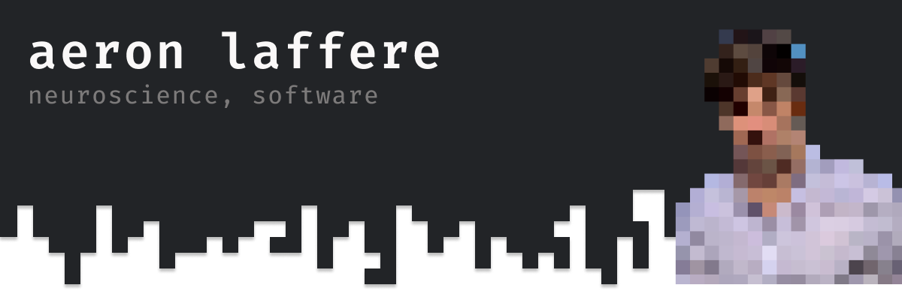

```javascript
const aeron = {
  technologies: {
    backEnd: {
      js: ["Node"],
      python: ["Django", "FastAPI"],
    },
    frontEnd: {
      js: ["React", "Svelte", "HTMX"]
    },
    mobileApp: {
      native: ["iOS Development"]
    }
  }
}
```

<!-- [](https://github.com/anuraghazra/github-readme-stats) -->

---

I'm a graduate student working in the departments of [Physiology, Anatomy, and Genetics](https://www.dpag.ox.ac.uk) and [Experimental Psychology](https://www.psy.ox.ac.uk) at the University of Oxford.
